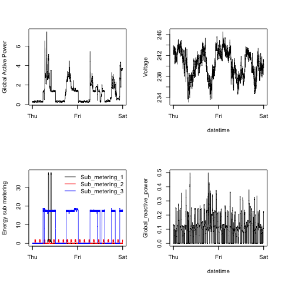

```{css, echo=FALSE}
h1 {
  font-size: 25px;
  color: rgb(106, 90, 205);
}
h2 {
  font-size: 20px;
  color: rgb(255, 112, 141);
}
```

```{r setup, message = FALSE, echo=FALSE}
knitr::opts_chunk$set(message = FALSE, eval = TRUE) ## obvs, eval = TRUE in real life
library(knitr)
library(tidyverse)
library(kableExtra)
```

```{r load_data, echo = FALSE}
exampleS <- read.table(file = 'exampleSheet.tsv', sep = '\t', header = TRUE)
exampleS$column_name <- paste("`", exampleS$column_name, "`", sep = "")
splitSheet <- split(exampleS, exampleS$table_name)
```

```{r def_func, echo = FALSE}
## function to create the formatted table from a table name (as a string)
make_table <- function(x) {
  kable(
    splitSheet[[x]][,c(2,3)],
    col.names = c("Column name", "Description"),
    row.names = FALSE,
    format="html"
  ) %>%
    kable_styling(bootstrap_options = c("hover"))
}
```

{width=100%}

<font size="50"> <span style="color: red;">text</span></font> 

# Data dictionary

## Table 1

&nbsp;&nbsp;&nbsp;&nbsp;&nbsp;&nbsp;&nbsp;&nbsp; `table_1`

Here we have the descriptors for `table_1`. Insert link [here](https://www.google.com/)

```{r insert_table_1, echo = FALSE}
make_table("table_1")
```

More information here:



## Table 2

&nbsp;&nbsp;&nbsp;&nbsp;&nbsp;&nbsp;&nbsp;&nbsp; `table_2`

Here we have the descriptors for `table_2`. Insert link [here](https://www.google.com/)

```{r insert_table_2, echo = FALSE}
make_table("table_2")
```

## Table 3

&nbsp;&nbsp;&nbsp;&nbsp;&nbsp;&nbsp;&nbsp;&nbsp; `table_3`

Here we have the descriptors for `table_3`. Insert link [here](https://www.google.com/)

```{r insert_table_3, echo = FALSE}
make_table("table_3")
```

## Table 4

&nbsp;&nbsp;&nbsp;&nbsp;&nbsp;&nbsp;&nbsp;&nbsp; `table_4`

Here we have the descriptors for `table_4`. Insert link [here](https://www.google.com/)

```{r insert_table_4, echo = FALSE}
make_table("table_4")
```
