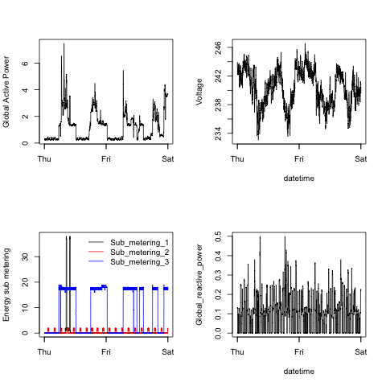

{width=100%}

 text 

# Data dictionary

## Table 1

&nbsp;&nbsp;&nbsp;&nbsp;&nbsp;&nbsp;&nbsp;&nbsp; `table_1`

Here we have the descriptors for `table_1`. Insert link [here](https://www.google.com/)

<table class="table table-hover" style="margin-left: auto; margin-right: auto;">
 <thead>
  <tr>
   <th style="text-align:left;"> Column name </th>
   <th style="text-align:left;"> Description </th>
  </tr>
 </thead>
<tbody>
  <tr>
   <td style="text-align:left;"> `column_name_1` </td>
   <td style="text-align:left;"> description of data in this column, column 1 </td>
  </tr>
  <tr>
   <td style="text-align:left;"> `column_name_2` </td>
   <td style="text-align:left;"> description of data in this column, column 2 </td>
  </tr>
  <tr>
   <td style="text-align:left;"> `column_name_3` </td>
   <td style="text-align:left;"> description of data in this column, column 3 </td>
  </tr>
  <tr>
   <td style="text-align:left;"> `column_name_4` </td>
   <td style="text-align:left;"> description of data in this column, column 4 </td>
  </tr>
  <tr>
   <td style="text-align:left;"> `column_name_5` </td>
   <td style="text-align:left;"> description of data in this column, column 5 </td>
  </tr>
  <tr>
   <td style="text-align:left;"> `column_name_6` </td>
   <td style="text-align:left;"> description of data in this column, column 6 </td>
  </tr>
  <tr>
   <td style="text-align:left;"> `column_name_7` </td>
   <td style="text-align:left;"> description of data in this column, column 7 </td>
  </tr>
  <tr>
   <td style="text-align:left;"> `column_name_8` </td>
   <td style="text-align:left;"> description of data in this column, column 8 </td>
  </tr>
  <tr>
   <td style="text-align:left;"> `column_name_9` </td>
   <td style="text-align:left;"> description of data in this column, column 9 </td>
  </tr>
</tbody>
</table>

More information here:

## Table 2

&nbsp;&nbsp;&nbsp;&nbsp;&nbsp;&nbsp;&nbsp;&nbsp; `table_2`

Here we have the descriptors for `table_2`. Insert link [here](https://www.google.com/)

<table class="table table-hover" style="margin-left: auto; margin-right: auto;">
 <thead>
  <tr>
   <th style="text-align:left;"> Column name </th>
   <th style="text-align:left;"> Description </th>
  </tr>
 </thead>
<tbody>
  <tr>
   <td style="text-align:left;"> `attribute_1` </td>
   <td style="text-align:left;"> add text here 1.1 </td>
  </tr>
  <tr>
   <td style="text-align:left;"> `attribute_2` </td>
   <td style="text-align:left;"> add text here 1.2 </td>
  </tr>
  <tr>
   <td style="text-align:left;"> `attribute_3` </td>
   <td style="text-align:left;"> add text here 1.3 </td>
  </tr>
  <tr>
   <td style="text-align:left;"> `attribute_4` </td>
   <td style="text-align:left;"> add text here 1.4 </td>
  </tr>
  <tr>
   <td style="text-align:left;"> `attribute_5` </td>
   <td style="text-align:left;"> add text here 1.5 </td>
  </tr>
  <tr>
   <td style="text-align:left;"> `attribute_6` </td>
   <td style="text-align:left;"> add text here 1.6 </td>
  </tr>
  <tr>
   <td style="text-align:left;"> `attribute_7` </td>
   <td style="text-align:left;"> add text here 1.7 </td>
  </tr>
  <tr>
   <td style="text-align:left;"> `attribute_8` </td>
   <td style="text-align:left;"> add text here 1.8 </td>
  </tr>
  <tr>
   <td style="text-align:left;"> `attribute_9` </td>
   <td style="text-align:left;"> add text here 1.9 </td>
  </tr>
  <tr>
   <td style="text-align:left;"> `attribute_10` </td>
   <td style="text-align:left;"> add text here 1.10 </td>
  </tr>
  <tr>
   <td style="text-align:left;"> `attribute_11` </td>
   <td style="text-align:left;"> add text here 1.11 </td>
  </tr>
  <tr>
   <td style="text-align:left;"> `attribute_12` </td>
   <td style="text-align:left;"> add text here 1.12 </td>
  </tr>
  <tr>
   <td style="text-align:left;"> `attribute_13` </td>
   <td style="text-align:left;"> add text here 1.13 </td>
  </tr>
</tbody>
</table>

## Table 3

&nbsp;&nbsp;&nbsp;&nbsp;&nbsp;&nbsp;&nbsp;&nbsp; `table_3`

Here we have the descriptors for `table_3`. Insert link [here](https://www.google.com/)

<table class="table table-hover" style="margin-left: auto; margin-right: auto;">
 <thead>
  <tr>
   <th style="text-align:left;"> Column name </th>
   <th style="text-align:left;"> Description </th>
  </tr>
 </thead>
<tbody>
  <tr>
   <td style="text-align:left;"> `name` </td>
   <td style="text-align:left;"> client name </td>
  </tr>
  <tr>
   <td style="text-align:left;"> `date` </td>
   <td style="text-align:left;"> first date of registry </td>
  </tr>
  <tr>
   <td style="text-align:left;"> `amount` </td>
   <td style="text-align:left;"> amount spent in total </td>
  </tr>
</tbody>
</table>

## Table 4

&nbsp;&nbsp;&nbsp;&nbsp;&nbsp;&nbsp;&nbsp;&nbsp; `table_4`

Here we have the descriptors for `table_4`. Insert link [here](https://www.google.com/)

<table class="table table-hover" style="margin-left: auto; margin-right: auto;">
 <thead>
  <tr>
   <th style="text-align:left;"> Column name </th>
   <th style="text-align:left;"> Description </th>
  </tr>
 </thead>
<tbody>
  <tr>
   <td style="text-align:left;"> `emp_id` </td>
   <td style="text-align:left;"> employee id code </td>
  </tr>
  <tr>
   <td style="text-align:left;"> `first_name` </td>
   <td style="text-align:left;"> first (given) name </td>
  </tr>
  <tr>
   <td style="text-align:left;"> `last_name` </td>
   <td style="text-align:left;"> last name </td>
  </tr>
  <tr>
   <td style="text-align:left;"> `dpt` </td>
   <td style="text-align:left;"> department </td>
  </tr>
  <tr>
   <td style="text-align:left;"> `location` </td>
   <td style="text-align:left;"> city of residency </td>
  </tr>
</tbody>
</table>
